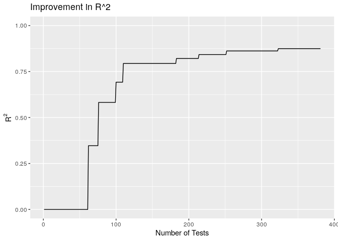
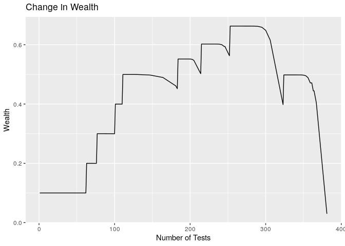

<!-- README.md is generated from README.Rmd. Please edit that file -->

# rai

<!-- badges: start -->

<!-- badges: end -->

## Overview

rai provides a modified implementation of stepwise regression that
greedily searches the space of interactions among features in order to
build polynomial regression models. Furthermore, the hypothesis tests
conducted are valid post model selection due to the use of a revisiting
procedure that implements an alpha-investing rule. As a result, the set
of rejected sequential hypotheses is proven to control the marginal
false discover rate. When not searching for polynomials, the package
provides a statistically valid algorithm to run and terminate stepwise
regression.

For more information, see the corresponding paper: [Revisiting
Alpha-Investing: Conditionally Valid Stepwise
Regression](https://arxiv.org/abs/1510.06322).

## Installation

You can install the released version of rai from
[CRAN](https://CRAN.R-project.org) with:

``` r
install.packages("rai")
```

And the development version from [GitHub](https://github.com/) with:

``` r
# install.packages("devtools")
devtools::install_github("korydjohnson/rai")
```

## Usage

``` r
library(rai)
#> Registered S3 methods overwritten by 'ggplot2':
#>   method         from 
#>   [.quosures     rlang
#>   c.quosures     rlang
#>   print.quosures rlang
data("CO2")
theResponse = CO2$uptake
theData = CO2[ ,-5]
rai_out = rai(theData, theResponse)
```

The returned object includes a linear model object of the identified
model:

``` r
summary(rai_out$model)
#> 
#> Call:
#> lm(formula = aucOut$formula, data = data.frame(y = theResponse, 
#>     theData))
#> 
#> Residuals:
#>     Min      1Q  Median      3Q     Max 
#> -8.3982 -2.4690  0.1839  2.6110  9.9281 
#> 
#> Coefficients:
#>                                                Estimate Std. Error t value
#> (Intercept)                                   1.354e+01  1.969e+00   6.878
#> I(TypeMississippi)                           -2.571e+00  2.291e+00  -1.122
#> I(conc)                                       8.830e-02  8.722e-03  10.123
#> I(conc * conc)                               -6.007e-05  7.794e-06  -7.707
#> I(Treatmentchilled)                          -3.692e+00  1.094e+00  -3.374
#> I(PlantMc2)                                  -5.591e+00  1.812e+00  -3.086
#> I(conc * TypeMississippi)                    -2.495e-02  7.819e-03  -3.191
#> I(conc * Treatmentchilled * TypeMississippi) -1.028e-02  3.010e-03  -3.414
#> I(conc * conc * conc * TypeMississippi)       1.839e-08  6.702e-09   2.744
#>                                              Pr(>|t|)    
#> (Intercept)                                  1.57e-09 ***
#> I(TypeMississippi)                            0.26526    
#> I(conc)                                      1.12e-15 ***
#> I(conc * conc)                               4.31e-11 ***
#> I(Treatmentchilled)                           0.00118 ** 
#> I(PlantMc2)                                   0.00285 ** 
#> I(conc * TypeMississippi)                     0.00207 ** 
#> I(conc * Treatmentchilled * TypeMississippi)  0.00104 ** 
#> I(conc * conc * conc * TypeMississippi)       0.00758 ** 
#> ---
#> Signif. codes:  0 '***' 0.001 '**' 0.01 '*' 0.05 '.' 0.1 ' ' 1
#> 
#> Residual standard error: 4.029 on 75 degrees of freedom
#> Multiple R-squared:  0.8746, Adjusted R-squared:  0.8612 
#> F-statistic: 65.36 on 8 and 75 DF,  p-value: < 2.2e-16
```

You can view a summary of the series of tests conducted by rai and the
results of those tests by calling `summary` on the returned object:

``` r
summary(rai_out)
#> $plot_rS
```



    #> 
    #> $plot_wealth



    #> 
    #> $experts
    #> # A tibble: 9 x 4
    #>   expert             nRej nFeatures order
    #>   <chr>             <int>     <int> <dbl>
    #> 1 SMarginal             4        15     1
    #> 2 SPoly 13              0         1     2
    #> 3 SPoly 15              2         2     3
    #> 4 SPoly 15_15           0         3     4
    #> 5 SPoly 14              0         4     5
    #> 6 SPoly 10              0         5     6
    #> 7 SPoly 13_15           2         6     7
    #> 8 SPoly 13_14_15        0         7     8
    #> 9 SPoly 13_15_15_15     0         8     9
    #> 
    #> $tests
    #> # A tibble: 8 x 4
    #>   timesTested count nExperts expert           
    #>         <int> <int>    <int> <chr>            
    #> 1          22     1        1 SPoly 13_14_15   
    #> 2          12    15        3 SPoly 10         
    #> 3          11    10        5 SPoly 13_15_15_15
    #> 4          10     3        3 SPoly 13_15      
    #> 5           7     1        1 SMarginal        
    #> 6           6     2        2 SMarginal        
    #> 7           5     1        1 SMarginal        
    #> 8           1    16        7 SPoly 15_15      
    #> 
    #> $epochs
    #> # A tibble: 12 x 3
    #>    epoch  rCrit  nRej
    #>    <dbl>  <dbl> <int>
    #>  1     1 0.8        0
    #>  2     2 0.64       0
    #>  3     3 0.512      0
    #>  4     4 0.410      0
    #>  5     5 0.328      1
    #>  6     6 0.262      2
    #>  7     7 0.210      1
    #>  8     8 0.168      0
    #>  9     9 0.134      0
    #> 10    10 0.107      3
    #> 11    11 0.0859     1
    #> 12    12 0.0687     0
    #> 
    #> $stats
    #> $stats$maxPotentialIncrease_raiPlus
    #> [1] 0.01077552
    #> 
    #> $stats$nTests
    #> [1] 382
    #> 
    #> $stats$nEpochs
    #> [1] 12
    #> 
    #> $stats$nFeatures
    #> [1] 8
    #> 
    #> $stats$poly
    #> $stats$poly$tableDegrees
    #>   degree Freq
    #> 1      1    4
    #> 2      2    2
    #> 3      3    1
    #> 4      4    1
    #> 
    #> $stats$poly$tableInteraction
    #>   nUniqueFeatures Freq
    #> 1               1    5
    #> 2               2    2
    #> 3               3    1
    #> 
    #> 
    #> $stats$rS
    #> [1] 0.8745565
    #> 
    #> $stats$nFeaturesTested
    #> [1] 49
